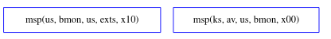
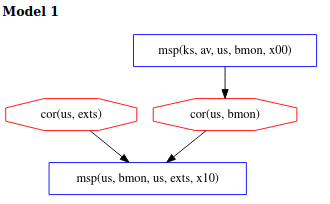
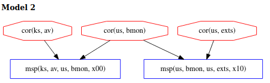
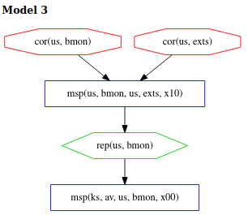

\[[Top](../README)\] \[[Next](../ex1b/ex1b)\]

# Example 1

```
*bank: @ks[av us bmon] +~+ @us[bmon us exts]
```

This example shows two measurements taken in parallel, indicated by the ~ 
operator. The bank issues separate requests for measurement
to *av* and *bmon* and forms the final evidence by joining the results. Allowing 
the measurements to happen in parallel has the effect of leaving the 
ordering of these events unconstrained. Therefore, the measurements can 
happen in any order. This is illustrated in the figure below through the 
absence of arrows between the two measurements. 
  


In the left measurement specification, *bmon* in *us* measures *exts*, also in *us*. 
On the right, *av* from its place in *ks* measures *bmon* 
in *us*. We can easily see the
motivation to choose these measurements: if the better-protected *av* reports that 
*bmon* is regular, *bmon's* measurement of *exts* can be reasonably trusted to be accurate. 
As discussed in detail below, applying no precendence relationship between the two measurements 
opens this attestation up to easy subversion by the adversary.  

The Chase models below are obtained with the following ex1.gln file:  
```
[ bound = 500, limit = 5000, input_order ]

% Assume adversary avoids detection at our main measurement
% event. Others can be added.
l(V) = msp(us, M, us, exts, X)
 => corrupt_at(us, exts, V).

% Assumptions about system dependencies.
depends(ks, C, ks, av) => false. 
depends(us, C, us, bmon) => false.
depends(us, C, us, exts) => false.

% Axioms stating "deep" components cannot be corrupted:
% This analysis allows all "deep" corruptions, so there are no axioms here.

% Axiom defining which components cannot be recently corrupted:
% This analysis allows all "recent" corruptions, so there are no axioms here.

m4_include(`ex1.gli')m4_dnl

m4_include(`ex1_dist.gli')m4_dnl

m4_include(`thy.gli')m4_dnl
``` 
  
The herald present at the top of the .gln file is described in the
main README and is used to set Chase execution parameters. The next
line of the .gln file
```
l(V) = msp(us, M, us, exts, X)
=> corrupt_at(us, exts, V).
```
defines the assumption that the adversary avoids detection at our main
measurment event, in our case at the measurement of *exts*. The
logical quantifiers in the statement are left implicit. All variables
before the `=>` are universally quantified. Any variables after the
`=>` that are not bound by the universal quantifier are existentially
quantified. Thus the formula above says that for every event V, if V
is labeled `msp(us, M, us, exts, X)`, then *exts* (in userspace) is
corrupt at V. Since our analysis assumes the evidence passes appraisal,
this means the adversary avoids detection at V. For more information please
see the section on input syntax
[here](https://ramsdell.github.io/chase/index.html#input) or view the
full Trust Analysis of Copland Specifications
[paper](https://copland-lang.org/resources/chase/ppdp/README).  Next,
the 3 dependency assumptions state that *av*, *bmon* and *exts* do not
have any components they depend on. We will skip the axioms for
defining *deep* and *recent* corruptions since for this example we are
allowing the adversary to perform both *deep* and *recent*
corruptions. The formation of these axoims are described in examples
later in the tutorial. Finally, the `m4_include` statements at the
bottom of the .gln file link in the other files needed for Chase.
  
## Analysis
Unfortunately, applying no constraints to the precedence relationship 
between the two measurements opens this attestation up to easy subversion 
by the adversary. In model 1, we see the scenario where the adversary corrupts *exts* 
and then performs a corruption of *bmon* after it is measured by *av* (yielding a regular 
measurement) and then before *bmon* measures *exts*, allowing the adversary to avoid detection 
by using the corrupt *bmon* to report *exts* as regular. We refer to the corruption of 
*bmon* as a *recent* corruption since its corruption occurs in a narrow timeframe between two measurement events.

  

Model 2 shows the case where *exts*, *bmon* and *av* have all been corrupted before the 
attestation begins. In this instance, each measuring component will report a regular state 
for each of the measured components, allowing the malicious extentions to go undetected. 
In this example, we refer to the corruption of *av* as a *deep* corruption, since because of 
its location in kernel space, it is considered better protected. 


 
Finally, in model 3 the adversary succeeds by corrupting 
both *bmon* and *exts* before the attestation begins. But in order to avoid 
detection at the measurement of *bmon* by *av*, the adversary relies on the 
possibility that this measurement could happen after the measurement of *exts*, 
providing an opportunity to repair *bmon* after it performs its measurement, 
but before it gets measured itself.    


How difficult is this to achieve? The adversary had to corrupt *bmon*, a realtively 
less-protected component, without time constraints, as well as repair *bmon*. 
Both actions are easy to carry out. The reason it is viable is a consequence of 
insufficiently constraining measurement precedence. Measurement order is as 
important to consider as the measurements themselves and the bank should order the measurements 
more deliberately. Deeper analysis of measurement ordering is explored in later examples.
    
  
Click [here](../ex1b/ex1b.md) to move on to a variation of this example.
  
