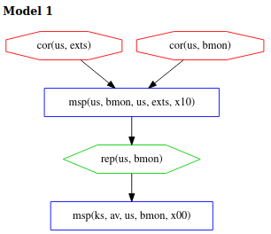

\[[Top](../README.md)\] \[[Prev](../ex1/ex1.md)\] \[[Next](../ex2/ex2.md)\]

# Example 1b

```
*bank: @ks[av us bmon] +~+ @us[bmon us exts]
```
The 3 models in the last example characterize all the ways for an
adversary to corrupt *exts* and avoid detection by the attestation. In
some of these models, the adversary performs actions that we might
consider to be difficult to perform. For example, in model 2, the
adversary corrupts *av* and similarly, in model 1, the adversary
corrupts *bmon* after it has been measured. A relying party may have
reason to believe that such adversary actions are unlikely. For
example, the relying party may trust the kernel level protections will
protect *av* from corruption, or that, say, address space layout
randomization makes a successful runtime corruption of *bmon*
extremely unlikely.  Alternatively, the relying party may simply be
willing to take these assumptions on blind faith. If the attestation
is meant to support an interaction that is not overly sensitive, the
relying party might believe the adversary is capable of performing one
of these actions, but also be willing to take such a risk.

For these reasons, the relying party may wish to view only those
models in the Chase output without these possibilities. Any models
that remain in the Chase output represent the residual risk beyond the
risk the relying party is comfortable with. Chase is run with the
following ex1b.gln file with axioms specified to disallow *deep* and
*recent* corruptions:
```
[ bound = 500, limit = 5000, input_order ]

% Assume adversary avoids detection at our main measurement
% event. Others can be added.
l(V) = msp(us, M, us, exts, X)
 => corrupt_at(us, exts, V).

% Assumptions about system dependencies.
depends(ks, C, ks, av) => false. 
depends(us, C, us, bmon) => false.
depends(us, C, us, exts) => false.

% Axioms defining "deep" components
% We don't want to see models with deep corruptions
l(V) = cor(ks, M) => false.

% Axiom defining which components cannot be recently corrupted
prec(V, V1) & l(V1) = cor(P,C) & ms_evt(V)
 => false. 

m4_include(`ex1b.gli')m4_dnl

m4_include(`ex1b_dist.gli')m4_dnl

m4_include(`thy.gli')m4_dnl
```  
The first axiom under the heading for *deep* corruptions tells Chase to disallow corruptions 
of kernel space components. The antecedent (on the left side of the =>) states that for every 
event V, where V has the form `cor(ks, M)`, the consequence (on the right side of =>) is false. 
This implies to Chase that any corruption event of a component in *ks* is not possible and should 
not be included in the Chase analysis.
The second axiom under the heading for *recent* corruptions tells Chase to disallow 
the corruption of components that happen after a measurement event. The antecedent states that if 
event V occurs before event V1 and event V1 is of the form `cor(P,C)` and event V is a 
measurement event, then the consequence is false. This means that Chase cannot consider V1 to be 
a corruption event when V is a measurement event and comes before event V1. We must explicitly 
tell Chase what components are considered *deep* and what we mean by *recent* events.

## Analysis  
As we see below, model 1 and 2 from ex1 are no longer found by Chase since model 1 contained 
a *recent* corruption and model 2 contained a *deep* corruption. Therefore we see that model 1 
in this example was model 3 from the last example. The corruptions of *bmon* and *exts* are 
not considered *deep* or *recent*, so this adversary behavior is still permitted under the 
additional constraints and the adversary still has one scenario for avoiding detection at *exts*.  


Click [here](../ex2/ex2.md) to move on to the next example.
