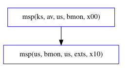
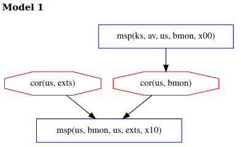
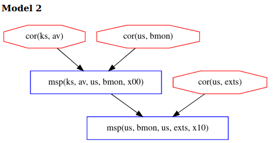

\[[Top](../README.md)\] \[[Prev](../ex1b/ex1b.md)\] \[[Next](../ex2b/ex2b.md)\]

# Example 2

```
*bank: @ks[av us bmon] +<+ @us[bmon us exts]
```

This Copland phase is nearly identical to example 1 but for one critical 
distinction: *av's* measurement of *bmon* is now required to occur before 
*bmon* can measure *exts*. This is indicated by the < operator joining the two 
measurements. We can see the precedence relationship in the figure below where the arrow 
represents the ordering of the events. 
  
  

The following models are produced inaccordance with ex2.gln. 
```
[ bound = 500, limit = 5000, input_order ]

% Assume adversary avoids detection at our main measurement
% event. Others can be added.
l(V) = msp(us, M, us, exts, X)
 => corrupt_at(us, exts, V).

% Assumptions about system dependencies.
depends(ks, C, ks, av) => false. 
depends(us, C, us, bmon) => false.
depends(us, C, us, exts) => false.

% Axioms defining stating "deep" components cannot be corrupted:
% This analysis allows all "deep" corruptions, so there are no axioms here.

% Axiom defining which components might be recently corrupted:
% This analysis allows all "recent" corruptions, so there are no axioms here.

m4_include(`ex2.gli')m4_dnl

m4_include(`ex2_dist.gli')m4_dnl

m4_include(`thy.gli')m4_dnl
```  
Note, the set of assumptions in ex2.gln are the same as ex1, the only 
difference are the include statements at the bottom to link in the 
correct files. 

## Analysis
Using the new phrase and the .gln file above, Chase produces two models.
Model 1 shows the case of the adversary performing a recent corruption of 
*bmon* in the narrow timeframe between the first measurement of *bmon* by *av* and
the second measurement of *exts* by *bmon*.  
  
  
Model 2 shows the case of the adversary performing a deep corruption of *av*.  
  
  
In both model 1 and 2, adversary actions are constrained more than in example 1 since 
we no longer obtain 3 models and the adversary now has to choose between two difficult 
corruption strategies. Delaying *av's* measurement now provides no advantage to the adversary in 
this topology, as this will also delay *bmon's* measurement. 
In order to avoid detection at *exts*, the adversary now has two 
choices: corrupt *av* and *bmon* before the attestation begins or else corrupt 
*bmon* after it is measured by *av* but before it measures *exts*. Thus, to avoid 
detection, the adversary must choose between a deep corruption of *av* or a 
recent corruption of *bmon*, both of which are hard. Prior theoretical work 
has shown this to be a general feature of bottom-up measurement topologies 
like this one, in which deeper components measure shallower ones before they 
perform their own measurements. The bank should choose this topology because 
it maximally constrains the adversary. 
  
Click [here](../ex2b/ex2b.md) to move on to a variation of this example.
