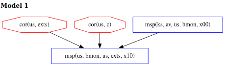

\[[Top](../README.md)\] \[[Prev](../ex2b/ex2b.md)\] \[[Next](../ex3/ex3.md)]

# Example 2c

```
*bank: @ks[av us bmon] +<+ @us[bmon us exts]
```

Our previous examples have not mentioned the effect of component dependencies on 
adversary actions. In this example, our Copland phrase is the same as in ex2 and ex2b, 
but we are now defining assumptions for the  dependencies of *av*, *bmon* and *exts*. 
We run the chase with the following ex2c.gln file, where we are still 
not interested in *recent* or *deep* corruptions but instead are curious about how Chase will 
reason about component dependencies.
  
```
[ bound = 500, limit = 5000, input_order ]

% Assume adversary avoids detection at our main measurement
% event. Others can be added.
l(V) = msp(us, M, us, exts, X)
 => corrupt_at(us, exts, V).

% Assumptions about system dependencies.
depends(ks, C, ks, av) => C = ker. 
depends(us, C, us, exts) => false.

% Axioms defining "deep" components
% We don't want to see models with deep corruptions
l(V) = cor(ks, M) => false.

% Axiom defining which components might be recently corrupted
prec(V, V1) & l(V1) = cor(P,C) & ms_evt(V)
 => false. 

m4_include(`ex2c.gli')m4_dnl

m4_include(`ex2c_dist.gli')m4_dnl

m4_include(`thy.gli')m4_dnl
```    
The difference between this .gln file and ones from the past examples is the "depends" statements. 
We are used to seeing these set to false, in the examples where we wish to prohibit Chase from 
considering the corruption of components in the *context* of other components. 
The first dependency `depends(ks, C, ks, av) => C = ker.` states that if *av* depends 
on anything, that thing is *ker*. Suppose in our system that the antivirus software 
(residing in ks) is dependent on the kernel, *ker*, in order to function correctly. 
If the kernel is corrupted with a rootkit, for instance, this could cause the *av* not to 
discover a corruption of *bmon*. The next dependency, `depends(us, C, us, exts) => false.` 
once again states that Chase should not consider any dependencies for *exts*. Notice that a 
depends statement has been omitted for *bmon*. This is how we indicate to Chase that a 
dependency for *bmon* may exist but we are unsure what the dependency is. In its analysis, Chase 
will explore the possibility that there exists a dependency for *bmon* that can be corrupted 
in order to avoid detection at *exts*. Since we do not know what component this is, Chase gives it 
the generic name "c" in the model below.  

## Analysis  
The model below shows that an adversary can corrupt *exts* and *c* (a component that *bmon* 
depends on) anytime before the attestation begins in order to avoid detection at *exts*, since 
*bmon* may falsely report *exts* as regular because of a malicious dependency.
  


We can see that component dependencies are important to consider when analyzing the strength 
of our Copland phrase. We may wish to add measurements of these dependencies to our attestation 
in order to create a more robust measurement of the system.

Click [here](../ex3/ex3.md) to move on to the next example.
