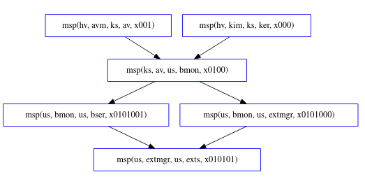
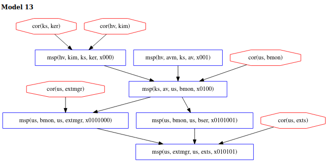
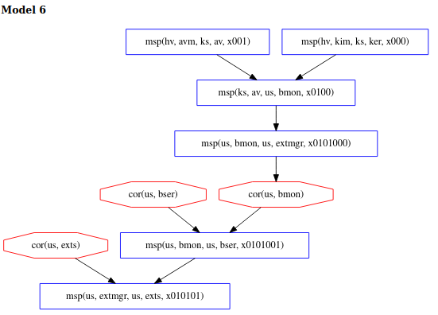
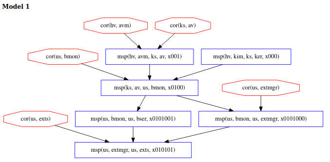

\[[Top](../README.md)\] \[[Prev](../ex2c/ex2c.md)\] \[[Next](../ex3b/ex3b.md)\]
# Example 3

```
*bank: @hv[(kim ks ker +~+ avm ks av)
	+<+ @ks[av us bmon
		+<+ @us[(bmon us extmgr +~+ 
			bmon us bser) +<+ extmgr us exts]]]
```

With Copland phrases as simple as those from Examples 1 and 2, it 
seems feasible to perform an analysis by hand. The simple examples 
previously discussed allow for a clear exposition of the underlying principles 
of the methodology. However, as soon as we begin to consider more 
complicated phrases involving numerous components with various 
dependencies and measurements that can be ordered in many ways, 
the analysis becomes much more complex and requires automation. 
   
As a concrete example, consider the more complex version of the bank's 
attestation problem. Instead of using a special-purpose measurer to 
simply list installed browser extensions, the bank is willing to accept 
a list generated by the browser's extension manager (*extmgr*). However, 
the bank is interested in gaining trust in the extension manager which 
relies on part of the core browser (*bser*) to function properly. Thus, the 
bank's special-purpose browser monitor (*bmon*) would now be responsible 
for measuring core parts of the browser code as well as the 
extension manager. For instance, it could hash elements of core functions 
needed to properly enumerate the list of extensions. The general-purpose 
anitvirus software (*av*) would still be responsible for scanning for malware 
affecting *bmon*. For extra assurance, the bank will also request a 
runtime kernel integrity measurement (*kim*) of the operating system kernel (*ker*). For completeness, 
we imagine the target system has a way to measure *av* itself from 
another component *avm* living in a Hyper-V VM. The above phrase 
accomplishes the described attestation and the figure below shows its 
Copland semantics.  

  

## Analysis
  
The value of automation provided by Chase for analyzing a phrase such as the 
one in this example becomes quickly apparent. In analyzing this phrase, we 
assume two dependency relations exist. Specifically we assume that *extmgr* 
depends on *bser* and that *av* depends on *ker*. We can see that the .gln 
we use for this phrase specifies these dependencies.  
``` 
[ bound = 500, limit = 5000, input_order ]

% Assume adversary avoids detection at our main measurement
% event. Others can be added.
l(V) = msp(us, M, us, exts, X)
 => corrupt_at(us, exts, V).

% Assumptions about system dependencies.
depends(us, C, us, extmgr) => C = bser.
depends(ks, C, ks, av) => C = ker.
depends(us, C, us, bmon) => false.
depends(us, C, us, exts) => false.
depends(us, C, us, bser) => false.
depends(ks, C, ks, ker) => false.
depends(hv, C, hv, kim) => false.
depends(ks, C, ks, avm) => false.
depends(hv, C, hv, avm) => false.

% Axioms stating "deep" components cannot be corrupted:
% This analysis allows all "deep" corruptions, so there are no axioms here.

% Axioms defining which components cannot be recently corrupted:
% This analysis allows all "recent" corruptions, so there are no axioms here.

m4_include(`ex3.gli')m4_dnl

m4_include(`ex3_dist.gli')m4_dnl

m4_include(`thy.gli')m4_dnl
```  
If we submit a query to Chase in which we only stipulate that the `corrupt_at` assumption holds 
for *exts* when it is measured assuming only that there are no unaccounted for 
dependency relationships, we discover 40 distinct ways for the adversary 
to avoid detection. Model 13 below shows the scenario where the adversary corrupts several 
system components, including *kim* and *ker* and avoids detection at *exts*. All 40 models 
are not included in this tutorial but we encourage readers to try to replicate the results for 
themselves.  

   
By submitting more constrained queries that make stronger 
assumptions, we can develop an understanding of what hoops an adversary 
is forced to jump through in those 40 possibilities. For example, if we 
additionally assume that neither of the components protected by Hyper-V 
are corrupted, there are only 24 possibilities, produced with the following 
.gln.  
```
[ bound = 500, limit = 5000, input_order ]

% Assume adversary avoids detection at our main measurement
% event. Others can be added.
l(V) = msp(us, M, us, exts, X)
 => corrupt_at(us, exts, V).

% Assumptions about system dependencies.
depends(us, C, us, extmgr) => C = bser.
depends(ks, C, ks, av) => C = ker.
depends(us, C, us, bmon) => false.
depends(us, C, us, exts) => false.
depends(us, C, us, bser) => false.
depends(ks, C, ks, ker) => false.
depends(hv, C, hv, kim) => false.
depends(ks, C, ks, avm) => false.
depends(hv, C, hv, avm) => false.

% Axioms defining "deep" components
% We don't want to see models with deep corruptions
l(V) = cor(hv, M) => false.

% Axiom defining which components might be recently corrupted
% This analysis allows all "recent" corruptions, so there are no axioms here.

m4_include(`ex3.gli')m4_dnl

m4_include(`ex3_dist.gli')m4_dnl

m4_include(`thy.gli')m4_dnl
```
We now observe that model 13 above is no longer possible but scenarios like 
in model 6 are still permitted. This result shows that 16 of the 40 original 
models contained corrupts of *kim* and/or *avm*.  


If, instead, we assumed only that no corruptions occur during the attestation (but allow components 
in Hyper-V to be corrupted) there are now 12 possibilities. 
```
[ bound = 500, limit = 5000, input_order ]

% Assume adversary avoids detection at our main measurement
% event. Others can be added.
l(V) = msp(us, M, us, exts, X)
 => corrupt_at(us, exts, V).

% Assumptions about system dependencies.
depends(us, C, us, extmgr) => C = bser.
depends(ks, C, ks, av) => C = ker.
depends(us, C, us, bmon) => false.
depends(us, C, us, exts) => false.
depends(us, C, us, bser) => false.
depends(ks, C, ks, ker) => false.
depends(hv, C, hv, kim) => false.
depends(ks, C, ks, avm) => false.
depends(hv, C, hv, avm) => false.

% Axioms defining "deep" components
% This analysis allows all "deep" corruptions, so there are no axioms here.

% Axiom defining which components might be recently corrupted
prec(V, V1) & l(V1) = cor(P,C) & ms_evt(V)
 => false. 

m4_include(`ex3.gli')m4_dnl

m4_include(`ex3_dist.gli')m4_dnl

m4_include(`thy.gli')m4_dnl
```  
We can see in model 1 below that all the corruptions happen before the 
attestation begins and that *avm* (a hyperviser component) is among the corrupted 
components.  

  
Finally, if we assume both that components in Hyper-V are not corrupted and that there are no other 
corruptions during the attestation, then the adversary cannot succeed and Chase finds no models.

Chase run with our layered attestation theory provides an interactive 
method for exploring the trust consequnces of Copland phrases. There are 
often many ways to collect any given set of measurements. By running Chase 
on the Copland phrases representing the variety of measurement strategies, 
we can understand the relative strengths and weaknesses among them. The 
fewer assumptions that need to be made in order to guarantee successful 
detection of any corruptions, the stronger the Copland phrase. Since there 
will never be a single solution to fit all use cases, we believe this 
exploratory approach to analyzing the trustworthiness of layered attestation 
strategies is an essential capability in designing attestation systems 
and protocols and in selecting sets of Copland phrases suitable for 
given situations. 

Click [here](../ex3b/ex3b.md) to move on to the last example.
