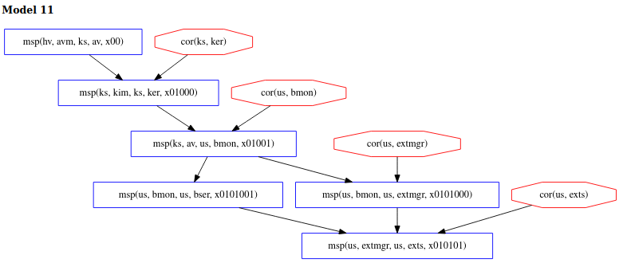

\[[Top](../README.md)\] \[[Prev](../ex3/ex3.md)\]

# Example 3b

```
*bank: @hv[avm ks av
	+<+ @ks[(kim ks ker +<+ av us bmon)
		+<+ @us[(bmon us extmgr +~+ 
			bmon us bser) +<+ extmgr us exts]]]
```  
In this example, we introduce an interesting concept. Notice that the 
Copland phrase is nearly the  same as the last example, however, it is now 
*ks* that requests the measurement of *ker* by *kim*. In addition, the .gln file below 
now specifies *ker* as a dependency of *kim*. Since *kim* measures *ker* as specificed in the first 
measurement in our phrase, we are curious to see what possibilities this 
creates for the adversary and ultimately, what models Chase finds.    
```
[ bound = 500, limit = 5000, input_order ]

% Assume adversary avoids detection at our main measurement
% event. Others can be added.
l(V) = msp(us, M, us, exts, X)
 => corrupt_at(us, exts, V).

% Assumptions about system dependencies.
depends(us, C, us, extmgr) => C = bser.
depends(ks, C, ks, av) => C = ker.
depends(us, C, us, bmon) => false.
depends(us, C, us, exts) => false.
depends(us, C, us, bser) => false.
depends(ks, C, ks, ker) => false.
depends(ks, C, ks, kim) => C = ker.
depends(ks, C, ks, avm) => false.
depends(hv, C, hv, avm) => false.

% Axioms stating "deep" components cannot be corrupted:
l(V) = cor(hv, M) => false.

% Axioms defining which components cannot be recently corrupted:
% This analysis allows all "recent" corruptions, so there are no axioms here.

m4_include(`ex3b.gli')m4_dnl

m4_include(`ex3b_dist.gli')m4_dnl

m4_include(`thy.gli')m4_dnl
```

## Analysis
Under the given assumptions, Chase yields 40 models. We are most interested 
in the models that resemble model 11 below. What makes this model interesting 
is the fact that *ker* can avoid detection at its own measurement since *ker* is 
a dependency of *kim*. It is important to keep relationships like this in 
mind when designing attestation policies.   
  

This concludes the Chase tutorial. Throughout this tutorial we have 
shown how to use and reason about the Chase models produed using various 
Copland phrases and under different assumptions. We believe that Chase is a 
valuable tool that can help policy makers write more robust and useful
attestations for their usecases. We have also shown how Chase can be used 
interactively to reason about the risk and trustworthiness of their 
attestations. More information on Chase, 
Copland and the work we're doing in regards to layered attestation can 
be found by following the links included in the main README.  
  
Click [here](../README.md) to return back to the top.
